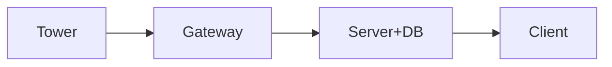

23/03/2026

Terminology:  
stop: A stop group, such as Mustek  
line: One direction of a line, such as Metro B Cerny Most, 152 Ceskomoravska  
departure: A specific time that a line's vehicle will be leaving a station  
assignment: Data that is assigned to a specific tower to be displayed on a screen, including the stop, line, departure, and so on.  

### Tower
The tower will be connected to a gateway via radio. It will periodically send health data (battery voltage) to the gateway and receive stop data from the gateway that it will display on a screen.  
It’ll display data using the graphics libary I wrote.  

### Gateway
The gateway will be a Node-RED flow in Hardwario Playground. It’ll connect to towers using a radio dongle.
Each gateway can have up to 5 towers connected to it. The gateway can make one HTTP request to the server to fetch data for all the towers connected to it, and then distribute it. But the gateway will not store each tower's assignments; they will be stored in the db.

### Server
Fetches live data from PID Public Departures (v2)	/v2/public/departureboards:  
https://api.golemio.cz/pid/docs/openapi/#/%F0%9F%95%92%20Public%20Departures%20(v2)/get_v2_public_departureboards  
The server should store all the user data, such as a user’s gateways, towers, and each tower's assignment.
There will be an endpoint that’ll basically be a wrapper for PID OpenData: it’ll receive a request from the gateway containing the gateway ID. The server will read each of the gateway's tower's assignments from the database, make a request to PID, then send the info to the gateway. The gateway will then distribute it to each individual tower.

### Client
The frontend should let the user:  
- Register their gateway  
- Set assignments for each tower  
- Have a dashboard to view their towers, and each tower's assignments and battery life  

